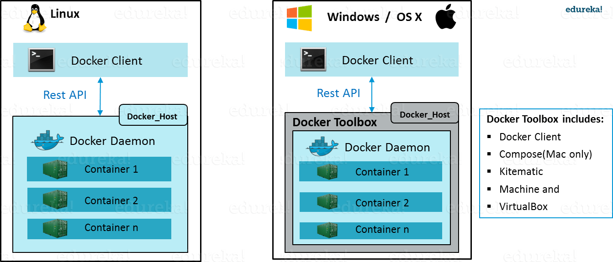
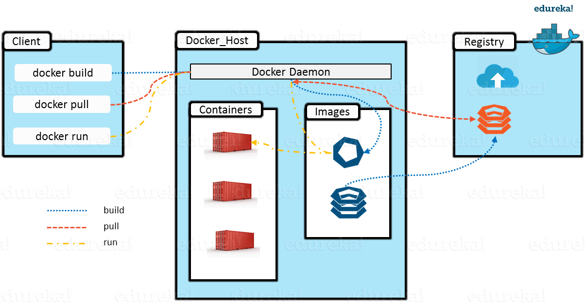
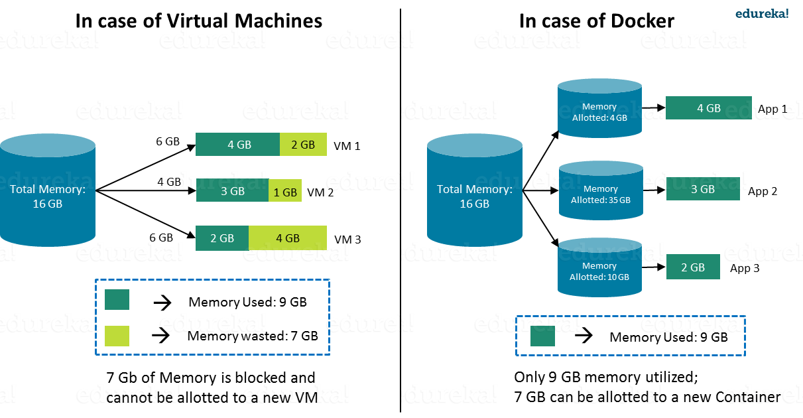
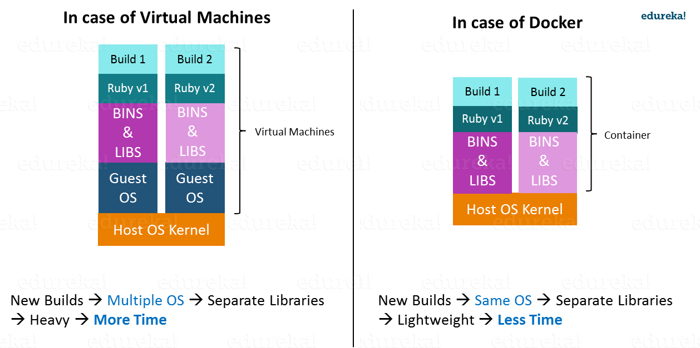

.. rst-class:: center

================================
BASIC DOCKER CONCEPTS
================================

1. What is Docker
***********************
Docker is a containerization platform that packages your application and all its dependencies 
together in the form of a docker container to | ensure that your application works seamlessly in 
any environment.

2. What is Container
***********************

- A container is a standard unit of software that packages up code and all its dependencies
  so the application runs quickly and reliably from one computing environment to another.

- Docker Container is a running instance of a Docker Image

- Docker containers that run on Docker Engine:

    + **Standard:** Docker created the industry standard for containers, so they could be portable anywhere
    + **Lightweight:** Containers share the machine’s OS system kernel and therefore do not require an OS per application, 
      driving higher server efficiencies and reducing server and licensing costs
    + **Secure:** Applications are safer in containers and Docker provides the strongest default isolation capabilities in the industry

.. code-block::

    Eg: Ubuntu container, CentOs container, mySQL container, wordpress container, etc.

Download image từ hub
----------------------
::

    Download `Title <http://link>`_ 

- Tạo image từ local

::

    :command:`cmd`

3. What is Docker Image
*************************

- A Docker container image (Docker Image) is a lightweight, standalone, executable package of software that includes everything needed to run an application: code, runtime, system tools, system libraries and settings.

- Container images become containers at runtime and in the case of Docker containers - images become containers when they run on Docker Engine. 

4. What is Docker Enginee
***************************
- Is simply the docker application that is installed on your host machine.
  It works like a client-server application which uses:

    * A server which is a type of long-running program called a daemon process
    * A command line interface (CLI) client
    * REST API is used for communication between the CLI client and Docker Daemon

    Docker Enginee

.. note::
    On Windows/Mac there is an additional Docker Toolbox component inside the Docker host. 
    This Docker Toolbox is an installer to quickly and easily install and setup a Docker environment on your Windows/iOS. 
    Docker Toolbox installs Docker Client, Machine, Compose (Mac only), Kitematic and VirtualBox.    

5. Docker Architecture
***********************
- **Docker client:** used to trigger Docker commands
- **Docker Host:** running the Docker Daemon
- **Docker Registry** – storing Docker Images (Local or remote/public repository)

    Docker Architecture

6. Dockers vs Virtual Machine
******************************

**Structure**

.. figure:: _static/images/Docker-vs-VMs.png
    :align: center
    :alt: This is the image caption

    Docker vs Virtual Machines

**Memory Allocation:**

    Memory Allocation comparision between Docker and VMs

**Startup Time:**

    Startup time comparision between Docker and VMs    

* First item
* Second item

  * Sub item

* Third item

Tables are really easy to write:

=========== ========
Country     Capital
=========== ========
France      Paris
Japan       Tokyo
=========== ========

`báo dân trí <dantri.com>`_'

``*``

* This is a bulleted list.
* It has two items, the second
  item uses two lines. (note the indentation)

1. This is a numbered list.
#. It has two items too.
#. This is a numbered list.
#. It has two items too.

.. code-block:: python

  import this

.. note::
    Fuck

.. math::
   (a + b)^2 = a^2 + 2ab + b^2

   (a - b)^2 = a^2 - 2ab + b^2

.. warning::
    Dont try it at home